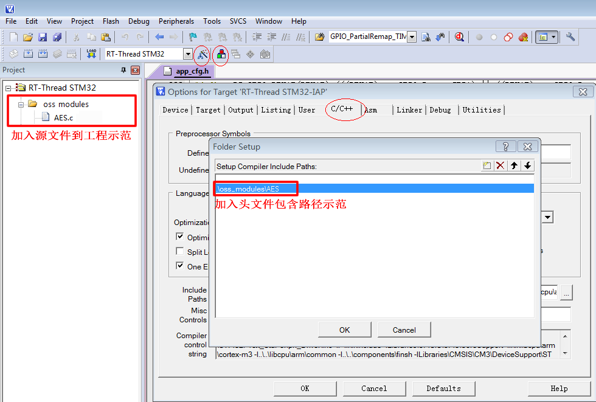

<!-- +++
author = "XT"
comments = false
date  = "2023-02-25"
draft = false
share = false
image = ""
menu  = ""
slug  = ""
title = "AES-128 加密算法"
+++ -->

### 一、说明

<details close=""><summary>1、功能简介</summary>

本 AES-128 模块的密钥长度只支持 128位【16字节】，并且要求数据长度必须 16 字节对齐，否则需要用户自行填充对齐（一般填充 0）。  
资源：[github 仓库](https://github.com/lmshao/AES)、[gitcode 加速](https://gitcode.net/mirrors/lmshao/AES)、[作者博文](https://blog.csdn.net/shaosunrise/article/details/80219950)

SHA、MD5、AES、DES 摘要/加密算法简介：

* SHA　不可逆过程的摘要算法，结果是【20字节】【32字节】【64字节】，主要用途有：验证消息完整性，安全访问认证，数据签名。
* MD5　不可逆过程的摘要算法，结果是 128位【16字节】，主要用途有：验证消息完整性，安全访问认证，数据签名。
* AES　新一代的对称加密算法，密钥长度可以选择 128位【16字节】，192位【24字节】和 256位【32字节】密钥。
* DES　比较老的对称加密算法，密钥长度是 56位【7字节】。一共有三个参数入口：原文，密钥，加密模式。
* 3DES 比较老的对称加密算法，加长了密钥长度，可以为 112位【14字节】 或 168位【21字节】。
* RSA　非对称加密，有公钥和私钥。公钥可公开给公众对数据加密，私钥则是私人对数据解密不能公开。

</details>

<details close=""><summary>2、环境要求</summary>

|  环境  |  要求  |
| :----- | :----- |
| 软件环境 | 无特别要求 |
| 硬件环境 | 有一定要求 |
| 依赖环境 | 无特别要求 |

</details>

### 二、移植

<details close=""><summary>1、添加源文件</summary>

将模块源文件、文件包含路径添加到工程，示例：



</details>

<details close=""><summary>2、包含头文件</summary>

在使用模块的应用程序中加入头文件包含，示例：  

```c
#include "AES.h"
```

</details>

### 三、使用

<details close=""><summary>1、应用示例</summary>

```c
#include "AES.h"

uint8_t key[16] = {0x2b, 0x7e, 0x15, 0x16, 0x28, 0xae, 0xd2, 0xa6, 0xab, 0xf7, 0x15, 0x88, 0x09, 0xcf, 0x4f, 0x3c};
uint8_t dat[16] = {0x32, 0x43, 0xf6, 0xa8, 0x88, 0x5a, 0x30, 0x8d, 0x31, 0x31, 0x98, 0xa2, 0xe0, 0x37, 0x07, 0x34};
uint8_t buf[16] = {0};

//要求++++++++++++++++++++++++++++++
//1、密钥长度固定为[16]字节，不能改！
//2、数据长度须对齐[16]字节，否则用户自行填充对齐（例如填充0对齐）
//3、因模块调用`printf()`函数，如果你程序环境不支持时，请屏蔽它！

//加密++++++++++++++++++++++++++++++
aesEncrypt(key/*密钥*/, 16/*密钥长度*/, dat/*将要加密数据*/, buf, 16/*数据长度*/);

//解密++++++++++++++++++++++++++++++
memcpy(dat, buf, 16);
aesDecrypt(key/*密钥*/, 16/*密钥长度*/, dat/*将要解密数据*/, buf, 16/*数据长度*/);

```

</details>