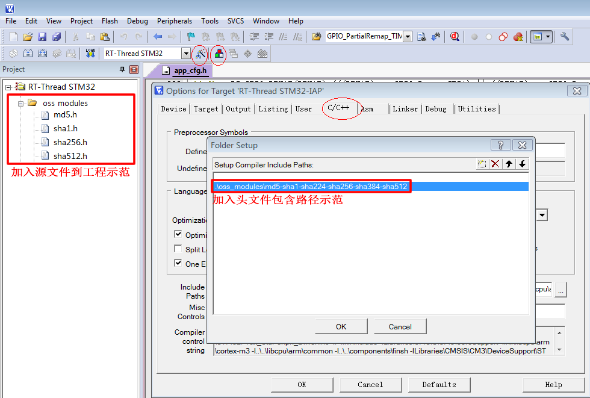

<!-- +++
author = "XT"
comments = false
date  = "2023-02-27"
draft = false
share = false
image = ""
menu  = ""
slug  = ""
title = "MD5、SHA 摘要算法"
+++ -->

### 一、说明

<details close=""><summary>1、功能简介</summary>

包含 MD5、SHA1、SHA224、SHA256、SHA512 非常适合嵌入式工程使用，单文件，无耦合。  

SHA 系列算法：

* 20字节 结果：SHA1；
* 32字节 结果：SHA224、SHA256；
* 64字节 结果：SHA384、SHA512、SHA512/224、SHA512/256；

SHA、MD5、AES、DES 摘要/加密算法简介：

* SHA　不可逆过程的摘要算法，结果是【20字节】【32字节】【64字节】，主要用途有：验证消息完整性，安全访问认证，数据签名。
* MD5　不可逆过程的摘要算法，结果是 128位【16字节】，主要用途有：验证消息完整性，安全访问认证，数据签名。
* AES　新一代的对称加密算法，密钥长度可以选择 128位【16字节】，192位【24字节】和 256位【32字节】密钥。
* DES　比较老的对称加密算法，密钥长度是 56位【7字节】。一共有三个参数入口：原文，密钥，加密模式。
* 3DES 比较老的对称加密算法，加长了密钥长度，可以为 112位【14字节】 或 168位【21字节】。
* RSA　非对称加密，有公钥和私钥。公钥可公开给公众对数据加密，私钥则是私人对数据解密不能公开。  

资源：[gitee 仓库](https://gitee.com/honrun_he/md5-sha1-sha224-sha256-sha384-sha512)、[mbedtls 库](https://github.com/ARMmbed/mbedtls "MbedTLS 前身是 PolarSLL，现已被 ARM 公司收购，是开源加密算法库， 由 C 语言编写的，没有外部依赖，是嵌入式系统最理想加密算法库，支持 Apache 2.0 license 或者 GPL 2.0 license 双重许可，可以自由应用于商业项目中。开源加密算法库还有 OpenSSL、WolfSSL、MesaLink。")  

</details>

<details close=""><summary>2、环境要求</summary>

|  环境  |  要求  |
| :----- | :----- |
| 软件环境 | 无特别要求 |
| 硬件环境 | 有一定要求 |
| 依赖环境 | 无特别要求 |

</details>

### 二、移植

<details close=""><summary>1、添加源文件</summary>

将模块源文件、文件包含路径添加到工程，示例：



</details>

<details close=""><summary>2、包含头文件</summary>

在使用模块的应用程序中加入头文件包含，示例：  

```c
#include "md5.h"
#include "sha1.h"
#include "sha256.h"
#include "sha512.h"
```

</details>

### 三、使用

<details close=""><summary>1、MD5 应用示例</summary>

```c
#include "md5.h"

//int i;
uint8_t datsrc[] = {"safkjsdawifkasfhwfkaldfahhfa"}; //要运算的数据
uint8_t result[16]; //结果寄存器

// 方式一：
if (0 != mbedtls_md5_ret(datsrc, sizeof(datsrc)-1, result))
{
	printf("return error!\n");
}/*
for(i=0; i<16; i++) 
{
	printf("%02x", result[i]);
}
printf("\n------------------------\n");*/

int32_t res1, res2, res3;
mbedtls_md5_context ctx;

// 方式二：
res1 = mbedtls_md5_starts_ret(&ctx);                           //初始化
res2 = mbedtls_md5_update_ret(&ctx, datsrc, sizeof(datsrc)-1); //导入数据（此处可以多次导入多段数据） 【备注：进行初步分组加密】
res3 = mbedtls_md5_finish_ret(&ctx, result);                   //计算并输出 16 字节 MD5 到 result[]【备注：进行后序的补足】
if ((res1 != 0) || (res2 != 0) || (res3 != 0))
{
	printf("return error!\n");
}/*
for(i=0; i<16; i++) 
{
	printf("%02x", result[i]);
}
printf("\n------------------------\n");*/
```

</details>

<details close=""><summary>2、SHA 应用示例</summary>

```c
#include "sha512.h"

//int i;
uint8_t datsrc[] = {"safkjsdawifkasfhwfkaldfahhfa"}; //要运算的数据
uint8_t result[64]; //结果寄存器

// 方式一：
if (0 != mbedtls_sha512_ret(datsrc, sizeof(datsrc)-1, result, 0/*SHA-512*/))
{
	printf("return error!\n");
}/*
for(i=0; i<64; i++) 
{
	printf("%02x", result[i]);
}
printf("\n------------------------\n");*/

int32_t res1, res2, res3;
mbedtls_sha512_context ctx;

// 方式二：
res1 = mbedtls_sha512_starts_ret(&ctx, 0/*SHA-512*/);             //初始化
res2 = mbedtls_sha512_update_ret(&ctx, datsrc, sizeof(datsrc)-1); //导入数据（此处可以多次导入多段数据） 【备注：进行初步分组加密】
res3 = mbedtls_sha512_finish_ret(&ctx, result);                   //计算并输出 16 字节 MD5 到 result[]【备注：进行后序的补足】
if ((res1 != 0) || (res2 != 0) || (res3 != 0))
{
	printf("return error!\n");
}/*
for(i=0; i<64; i++) 
{
	printf("%02x", result[i]);
}
printf("\n------------------------\n");*/
```

</details>
