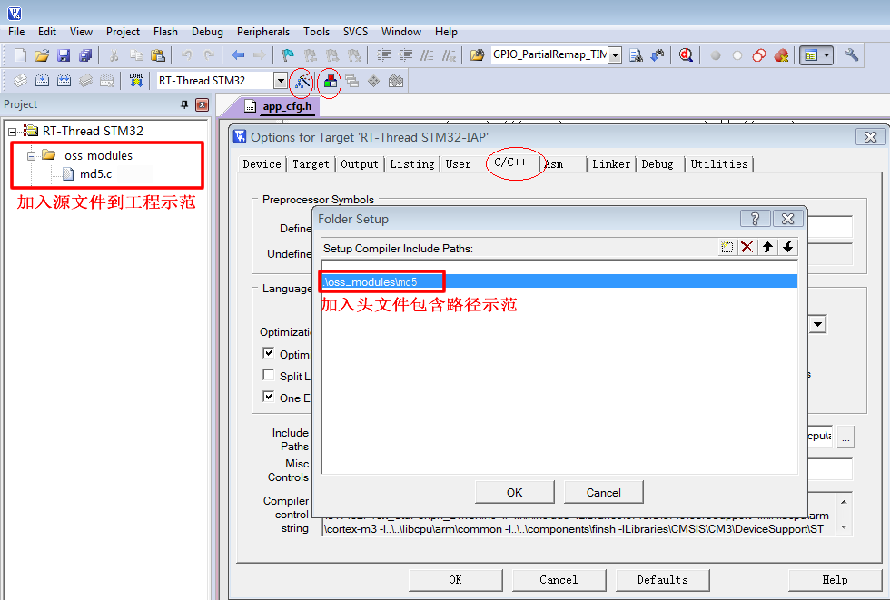

<!-- +++
author = "XT"
comments = false
date  = "2023-02-26"
draft = false
share = false
image = ""
menu  = ""
slug  = ""
title = "MD5 摘要算法"
+++ -->

### 一、说明

<details close=""><summary>1、功能简介</summary>

MD5 是摘要算法[哈希算法/散列算法]，可对任意长度的数据变换成一个 128bit（即：16字节） 的“数据指纹”，用于生成密钥并检测文档是否被篡改。  
资源：[github 仓库](https://github.com/talent518/md5)、[~~原作者仓库~~](https://github.com/chudongfang/HappyChat)、[原作者博文](https://blog.csdn.net/chudongfang2015/article/details/51736426)  
更多：[pod32g-MD5](https://github.com/pod32g/MD5)、[chinaran-md5](https://github.com/chinaran/Compute-file-or-string-md5)  

SHA、MD5、AES、DES 摘要/加密算法简介：

* SHA　不可逆过程的摘要算法，结果是【20字节】【32字节】【64字节】，主要用途有：验证消息完整性，安全访问认证，数据签名。
* MD5　不可逆过程的摘要算法，结果是 128位【16字节】，主要用途有：验证消息完整性，安全访问认证，数据签名。
* AES　新一代的对称加密算法，密钥长度可以选择 128位【16字节】，192位【24字节】和 256位【32字节】密钥。
* DES　比较老的对称加密算法，密钥长度是 56位【7字节】。一共有三个参数入口：原文，密钥，加密模式。
* 3DES 比较老的对称加密算法，加长了密钥长度，可以为 112位【14字节】 或 168位【21字节】。
* RSA　非对称加密，有公钥和私钥。公钥可公开给公众对数据加密，私钥则是私人对数据解密不能公开。

</details>

<details close=""><summary>2、环境要求</summary>

|  环境  |  要求  |
| :----- | :----- |
| 软件环境 | 无特别要求 |
| 硬件环境 | 有一定要求 |
| 依赖环境 | 无特别要求 |

</details>

### 二、移植

<details close=""><summary>1、添加源文件</summary>

将模块源文件、文件包含路径添加到工程，示例：



</details>

<details close=""><summary>2、包含头文件</summary>

在使用模块的应用程序中加入头文件包含，示例：  

```c
#include "md5.h"
```

</details>

### 三、使用

<details close=""><summary>1、应用示例</summary>

```c
#include "md5.h"

MD5_CTX md5; //MD5对象
unsigned char datsrc[13] = {12, 222, 11, 83, 4, 5, 189, 21, 48}; //要运算的数据
unsigned char result[16]; //结果寄存器

//每次运算 MD5 码，必须依次调用 3 个函数进行操作：
MD5Init(&md5);                           //初始化
MD5Update(&md5, datsrc, sizeof(datsrc)); //导入数据（此处可以多次导入多段数据） 【备注：进行初步分组加密】
MD5Final(&md5, result);                  //计算并输出 16 字节 MD5 到 result[]【备注：进行后序的补足】

```

</details>